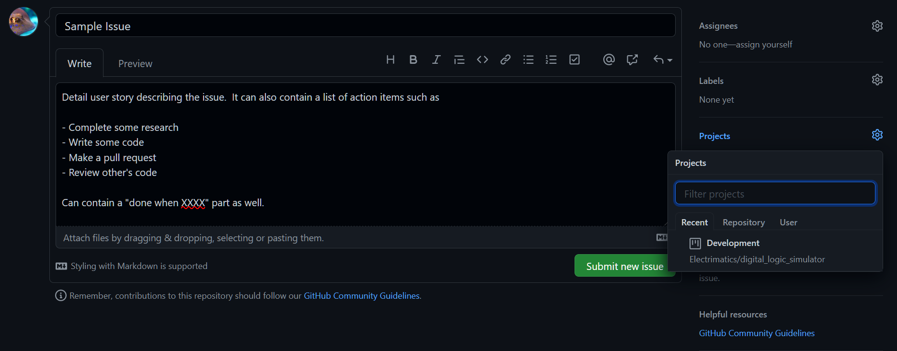

# Git Project Documentation
This document will outline how GitHub Project work, their automation capabilities, and how we integrated them into our project.  Furthermore, this document will detail the design decisions we made for organizing our projects, project columns, and ticket labels.

## GitHub Projects
GitHub projects are a way for multiple developers to storyboard their project and organize tickets.  One repository can have multiple projects that track different types of tickets and their progress.  Each project contains a list of columns where tickets live, and each column indicates the state the current ticket is in.  Developers will sometimes have to move tickets around manually, but GitHub provides many automated mechanims to move tickets around based on certain triggers (ie.: creating a ticket, opening a pull request, merging a pull request, etc.).  This allows developers to keep each other up-to-date while working on a project.

## Digital Logic Simulator GitHub Projects
Our repository contains 2 projects:

1. **Developer**: This project will track general development tickets and their progress.  This will be our "main" project board that is updated often
2. **Epic**: This project will track the progress of our epics.  This board will be updated less often but keep track of our progress on major milestones.

### Project Columns
The Developer board contains 5 columns:

1. **To-Do**: Tickets in the current iteration that are not started yet.
*Automation*: Tickets will be placed here when their issue is created and put onto the Development board.

2. **In-Progress**: Tickets that are currently being worked on.
*Automation*: When a pull request viewer requests changes, the ticket will be moved back to this column.

3. **Review**: Tickets with open pull requests pending development team review.

4. **External (Steakholder) Review**: Tickets with open questions pending external (CEO Ivan, Dr. Johnson, etc.) review.

5. **Done**: Tickets that are complete.
*Automation*: Tickets are moved here when their issue is closed or their pull request is merged.

The Epic board contains 3 columns:

1. **Upcoming**: Epics that have not been started yet.
*Automation*: Epic tickets will be placed here when their issue is created and put onto the Epic board.

2. **In-Progress**: Currently in-progress epics.
*Automation*: Epic tickets will be moved back to this column if the epic is re-opened.

3. **Done**: Completed epics.
*Automation*: Epic tickets will be moved here when their issue is closed.

### Ticket Labels
Each ticket should have one or more labels associated with them to describe what kind of task it is.  GitHub projects come with a variety of default tags, but our project has some custom tags such as:

* research
* configuration
* documentation
* epic
* and more to be determined...

The Epic ticket designates that a certain ticket is an epic.  This is a large ticket and should be placed only in the Epic project.  Epic tickets will have the epic tag as well as what type of epic it is (research, configuration, documentation, etc.).  Development tickets will have a label corresponding to the epic they are a part of.

### Creating an Issue
To create a new issue, use the following steps:

1. Create a new issue on GitHub

2. Give the issue a title and description

3. Assign developer(s) to the issue

4. Give the issue label(s).  If the issue is an epic, assign the epic label and the type of epic.  If the issue is a development ticket, assign the type of task it is and any other relevant labels.

New labels can be added with the "Edit Labels" button.  This will bring you to the label management page.  Add the new label and then click on the issue page > new issue button again.  Your previous issue should be saved.  The label management page can also be accessed on the issues page directly.

5. Put the issue on a project (development or epic)

This will automatically add a new ticket on the corresponding project.
